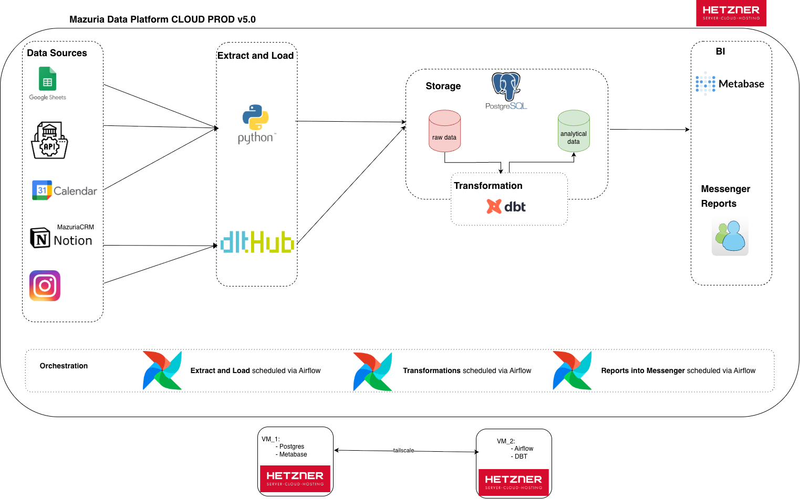
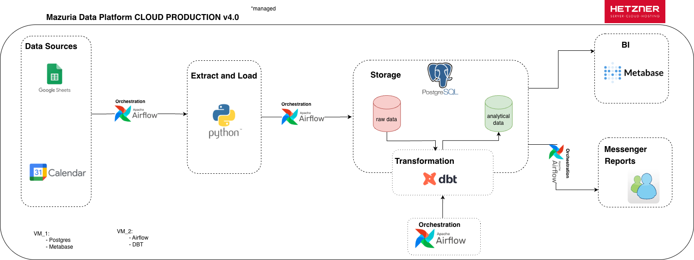
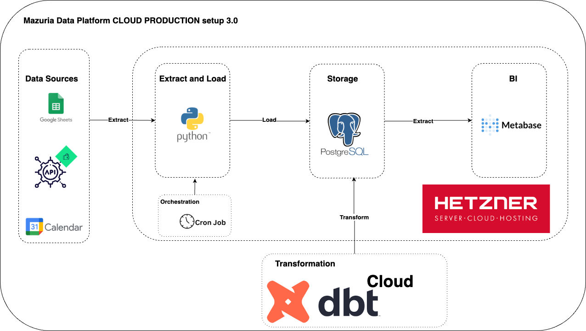
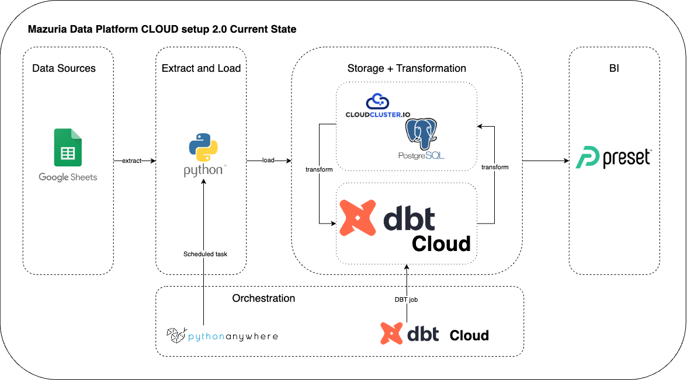
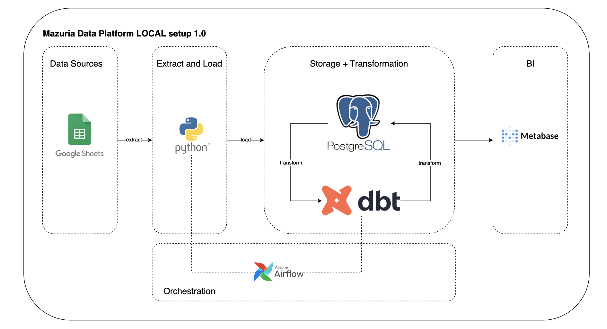

Welcome to Mazuria dbt project!

[Mazuria.studio Instagram](https://www.instagram.com/mazuria.studio/)

### Data Platform to support the decision making 

Mazuria Data Platform v5.0 Production extended and this is *current state*

- configured tailscale to support secure connection between vm's and to vm's
- added data from instagram and notion
- used DLT for the exctract and load of the new data sources

Mazuria Data Platform v4.0 Production

- migrated from the cron jobs to airflow on a separate vm
- added dbt core 
- configured messenger reports

Mazuria Data Platform v3.0 The cloud managed one

- moved on hetzner
- migrated to metabase from preset
- replaced pythonanywhere with cron jobs
- configured my own postgres on hetzner vm, no more postgres hosting on cloudclusters

Mazuria Data Platform v2.0 The cloud almost free

Mazuria Data Platform v1.0 The local one, MVP

### Other:

[Sources ERD](models/staging/README.md)

